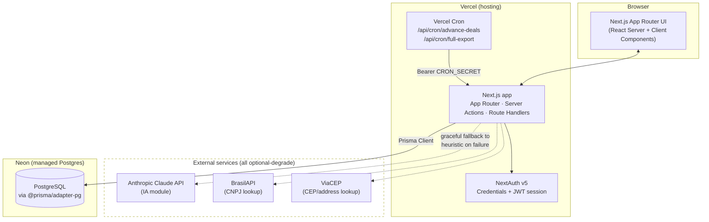
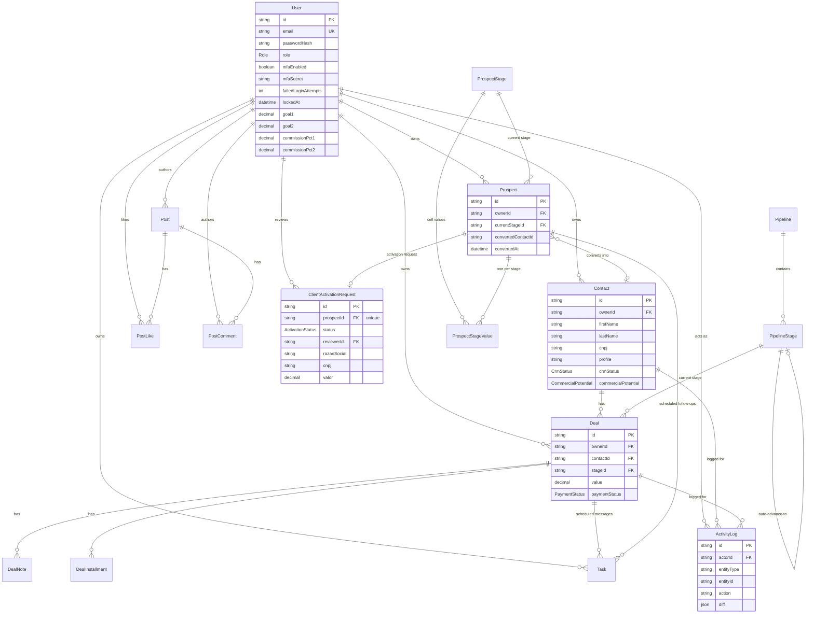
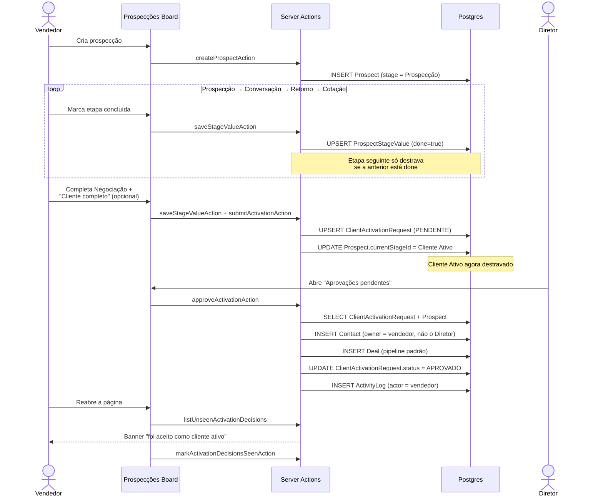
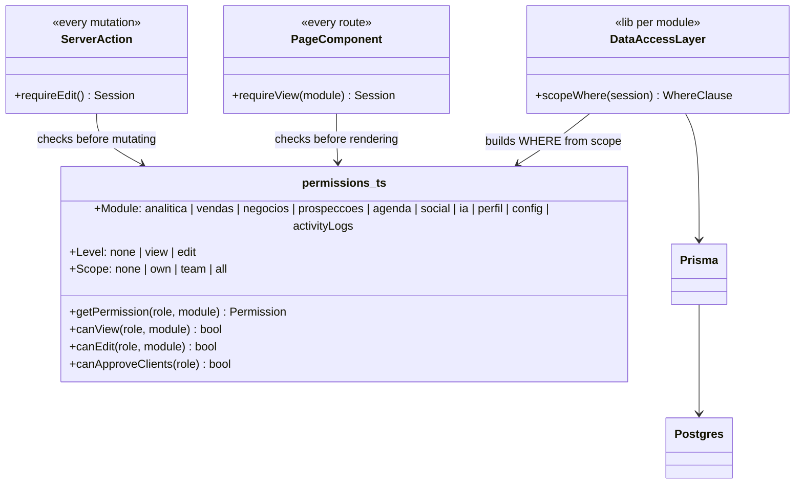

# System Map

Companion to `PRD.md` / `FEATURE-CATALOG.md`. Diagrams are Mermaid —
GitHub renders them natively in this file.

---

## 1. Architecture (deployment + request flow)

**Key properties:**
- Single Next.js project, no separate backend service — Server Actions
  *are* the API layer (no separate REST/GraphQL surface for the app's own
  UI).
- Every external call (Claude, BrasilAPI, ViaCEP) is best-effort: a
  failure degrades to a heuristic or an inline error message, never a
  crashed page.
- `prisma.config.ts` + `"build": "prisma migrate deploy && next build"`
  means every deploy applies pending migrations automatically — the
  database schema and the deployed code are never out of sync.

---

## 2. Data Model (ER diagram)

**Notable design choices, made deliberately:**
- `Prospect` and `Contact` are **separate entities**, not one table with a
  status flag — a prospect only ever *becomes* a `Contact` on approval
  (`Prospect.convertedContactId`), so the funnel's in-progress data
  (stage values, temperature, notes) never pollutes the client record,
  and a rejected/abandoned prospect leaves no client trace.
- `ClientActivationRequest` is 1:1 with `Prospect` (unique `prospectId`)
  and carries its own copy of the eventual `Contact` fields — it's the
  audit record of *what was submitted for approval*, independent of
  what the resulting `Contact` looks like after later edits.
- `profile` (client type: Indústria, Fábrica, …) is a free-text string,
  not an enum, on purpose — new categories don't require a schema
  migration; filter dropdowns are built from `DISTINCT` queries against
  real data.

---

## 3. Core Flow — Prospecção → Cliente Ativo (sequence)

---

## 4. RBAC Enforcement (class/module view)

Two independent enforcement layers (page guard + data-access scope) mean
a permission bug in one doesn't silently expose data — the query itself
is still scoped even if a page-level check were ever missed.
